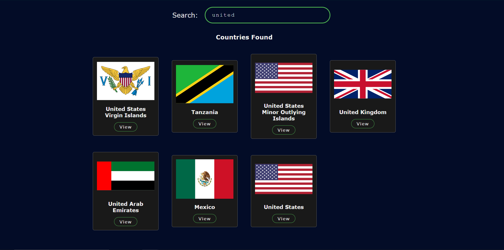
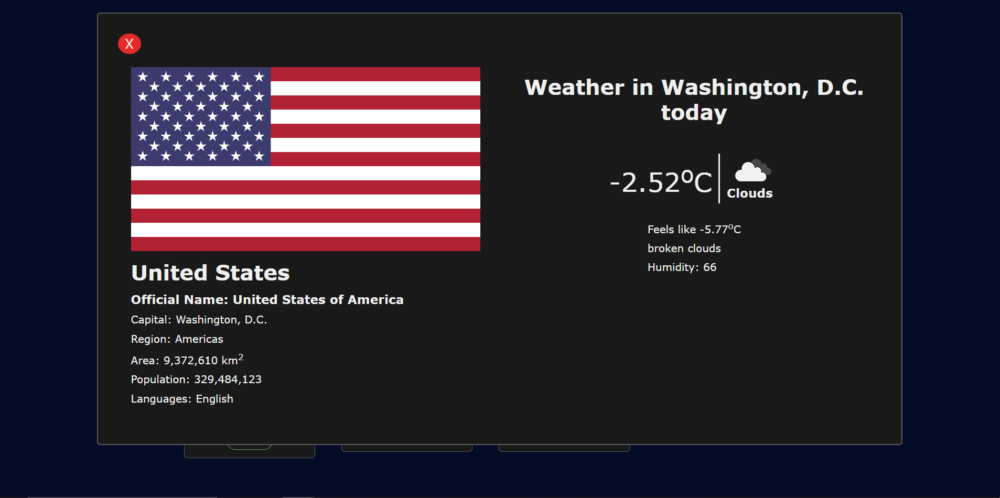

<h1 style="text-align:center"><a href="https://py-piyush.github.io/country-info/">Country Info</a></h1>
Display information of country along with weather data of the capital

### Live: https://py-piyush.github.io/country-info/

### Video Demo: https://youtu.be/E8Qj4tFIQEw

- Search for any country using search bar, you'll see a list of countries
- Click on view button to see information about the country

### APIs Information

- [restcountries API](https://restcountries.com/#api-endpoints-v3): To fetch information about countries.
- [openWeatherMap API](https://openweathermap.org/api): To fetch real-time weather data of the capital.

### Demo Pictures

 

